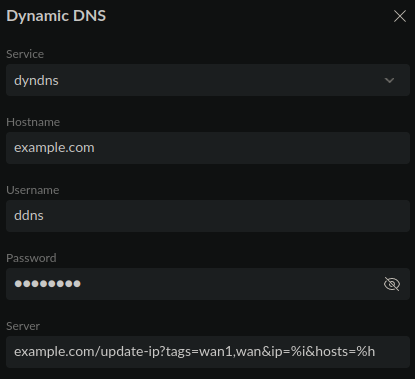

# Unifi Dream Machine DDNS configuration
For documentation regarding the internal workings of Unifi's DDNS implementation, see [technical.md](./technical.md). The rest of this document will explain how to configure DDNS.

Enter the following data into the DDNS configuration form:
- **Service**: dyndns
- **Hostname**: Enter the domains that you would like to update the DNS record of split by a comma. Ignored unless `useHostsFromRequest` is `true`. E.g. `example.com,domain.eu`. If you are setting the hosts in the config only, just enter a valid hostname such as `example.com`.
- **Username**: Enter the username `ddns`. This is actually ignored.
- **Password**: Enter a secure random password of your choosing.
- **Server**: Enter the URL to your executor without the scheme. Make sure to include the following query params: `ip=%i&hosts=%h` and optionally the `tags` parameter. Example: `example.com/update-ip?tags=wan1,wan&ip=%i&hosts=%h`.
